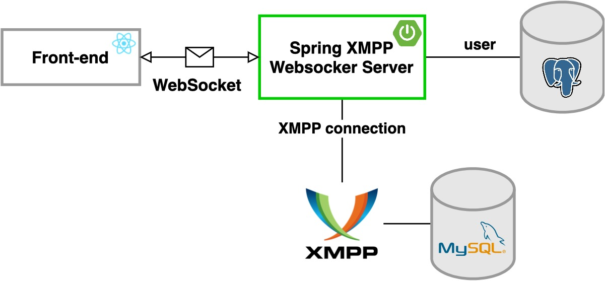

# spring-xmpp-websocket-reactjs



## Tech Stack

- **Spring Boot**
- [Smack](https://www.igniterealtime.org/projects/smack/)
- **Websocket**
- **[MySQL](https://sergiomartinrubio.com/articles/mysql-guide/)**
- **[Liquibase](https://sergiomartinrubio.com/articles/getting-started-with-liquibase-and-spring-boot/)**
- **[BCrypt](https://sergiomartinrubio.com/articles/storing-passwords-securely-with-bcrypt-and-java/)**

## Installation 

1. Run backend services:
    ```shell
    docker-compose up
    ```
2. Go to `http://localhost:9090` and setup openfire XMPP server:
    - Server settings:
        - Set "XMPP Domain Name" to `localhost`
        - Set "Server Host Name (FQDN)" to `localhost`
        - Leave the rest as it is.
    - Database Settings:
        - Select "Standard Database Connection"
        - Select "MySQL"
        - Replace on the "Database URL" `HOSTNAME` with `openfire-mysql` and `DATABASENAME` with `openfire`, then fill in the username and password.
    - Continue and ignore the rest of the steps.
3. Now you can use a websocket client to try out the backend application.
    - Endpoint: ws://localhost:8080/chat/sergio/pass
    - Connect will return `{"messageType":"JOIN_SUCCESS"}`
    - Send new message with body: 
        ```
        {
            "from": "sergio",
            "to": "jose",
            "content": "hello world",
            "messageType": "NEW_MESSAGE"
        }
        ```
        will return `{"from":"sergio","to":"jose","content":"hello world","messageType":"NEW_MESSAGE"}`

4. Run ReactJS App

```shell
npm install
npm start
```

## Running Tests

To run tests, run the following command

```bash
  mvn clean install
```
